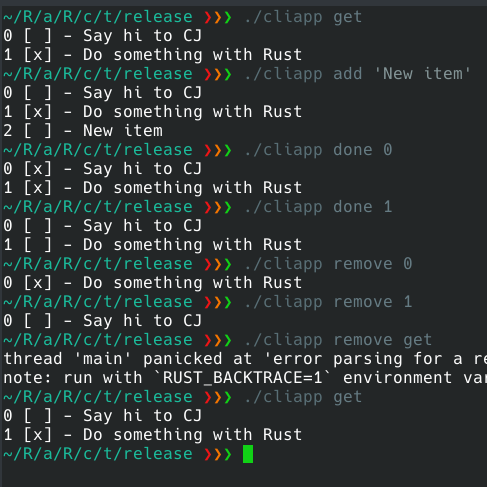

# RUST - System Programming

* core Values
  * safety, speed, and concurrency.
    * without having a **garbage collector**,
    * **embedding** in other languages,
    * programs with specific space and time requirements,
    * and writing low-level code,
      * like *device drivers* and
      * *operating systems*.
  * The Rust compiler runs on, and compiles to, a great number of platforms
  * guarentees **thread safety**
* variable bindings `let`
* compared to JS which runs every mili seconds a gfarbage collector
  * to remove all memory spaces which are **not referenced**
* Cross compiler to release for windows target from linux host

## Language Syntax

* macros `println!` - several types of functions in rust
* `let` variable declerations
  * everything is immutable by default
* Why rust has `;` semi colons ?
  * automatically inserted in JS, totally skipped in python
* Turbo Fish syntax `Vec<String>`
* Debug printing mode `println!("{:#?}", arguments)`
* Deep copy to get the ownership of Array item
* How to create Objects in rust?
* Difference between `str` and `string` memory type
* Is rust as fast as C++?
* Add list to the structure
* HOw are Arrays different from VectorsS

## Commandline apps in Rust

- statically compiled
- grep clone

1. Parsing command line arguments
2. `std::env::args()`
3. Channels and signal handling
4. Use configuration files
5. Exit codes
6. Logging
7. Running bash/python commands

```sh
rustup show
cargo init
cargo new <AppName>
cargo build --release
```




#### @ Reach Me @

* [Github](https://github.com/avimehenwal/)
* [Personal Page](https://avimehenwal.in)
* [Twitter Handle](https://twitter.com/avimehenwal)
* [Facebook](https://www.facebook.com/avimehanwal)
* [Google+](https://plus.google.com/115956966505193057246/posts)
* [LinkedIn](https://in.linkedin.com/in/avimehenwal)

<a href="https://www.buymeacoffee.com/F1j07cV" target="_blank"></a>

 Spread Love :hearts: and not :no_entry_sign: hatred   [](https://twitter.com/avimehenwal)
